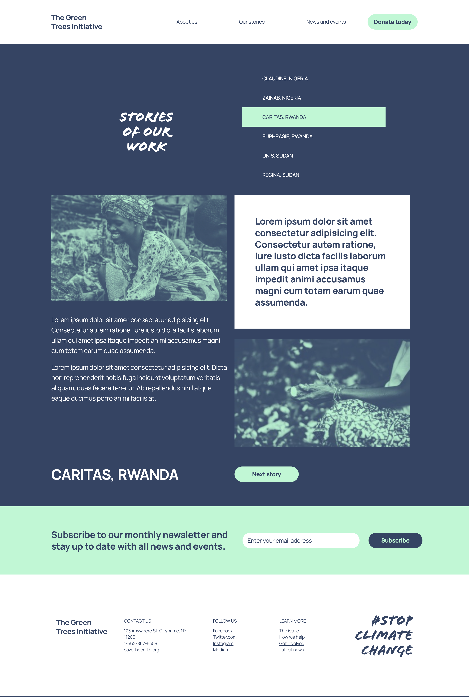

# Stop Climate Change

<div align="center">


</div>

## Overview

A single-page React site to raise awareness about climate change through stories, facts, and donation CTAs. Built with Create React App and deployed to GitHub Pages for easy sharing.

## Key Features

- Responsive landing and content pages with SCSS styling
- Client-side routing for About, News, Stories, and Donate
- Simple donation flow UI and social share sections

## Tech Stack

React 16.13.1, Create React App 3.4.1, React Router 5.1.2, Sass, Bootstrap 4, React Slick, GitHub Pages

## Architecture

SPA built with CRA. Routing via `BrowserRouter` and `Switch` with page components under `src/pages`. Styles organized with SCSS; static assets in `public/` and component image folders. Deployed using `gh-pages`.

## Performance & Accessibility

Leverages CRA optimizations for production builds; images organized per component. Uses semantic HTML and keyboard-navigable components where possible.

## Quality

- Linting: ESLint (react-app) • Formatting: —
- Type safety: — (JavaScript only)
- Tests: React Scripts/Jest available; no test files committed
- CI: — • Coverage: —

## Prerequisites

- Node.js: `18.17.0`

## Installation

```bash
git clone https://github.com/maxgalchenko/Stop-climate-change.git
cd Stop-climate-change
npm install
```

## Quick Start

```bash
npm start
# Production
npm run build
npm run deploy
```

Open http://localhost:3000

## Available Scripts

- `npm start` – Start the development server (CRA)
- `npm run build` – Build the app for production to `build/`
- `npm test` – Run tests in watch mode (Jest via react-scripts)
- `npm run eject` – Eject CRA configuration
- `npm run predeploy` – Build prior to deploy
- `npm run deploy` – Deploy `build/` to GitHub Pages

## Screenshots




---

## License

<div align="center">

Built with ❤️ by [Maksym Galchenko](https://github.com/maxgalchenko)

[](https://www.linkedin.com/in/galchenko-max/)
[](https://portfolio-green-six-29.vercel.app/)
[](mailto:galchenko.maksym@gmail.com)


</div>
